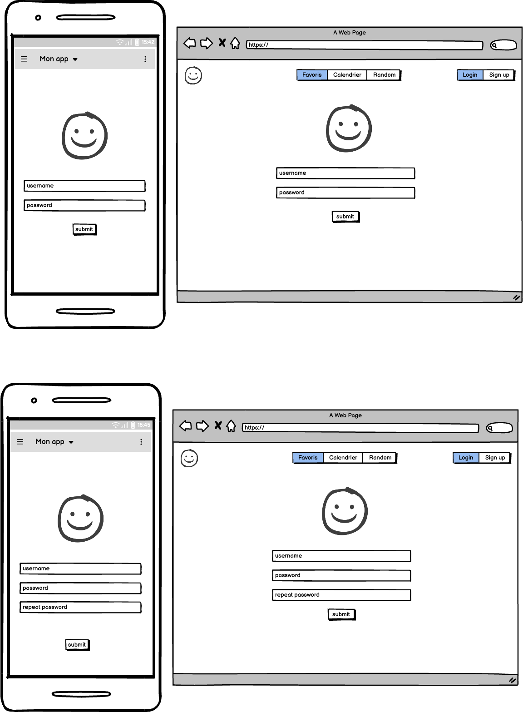
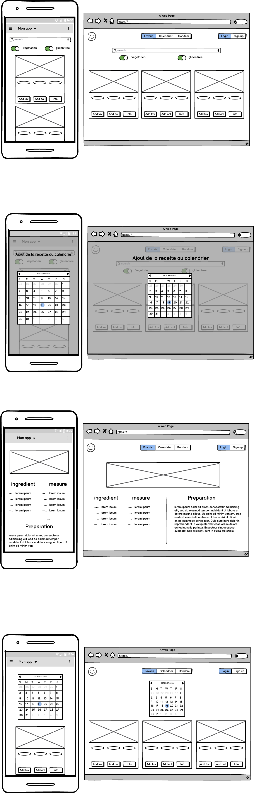
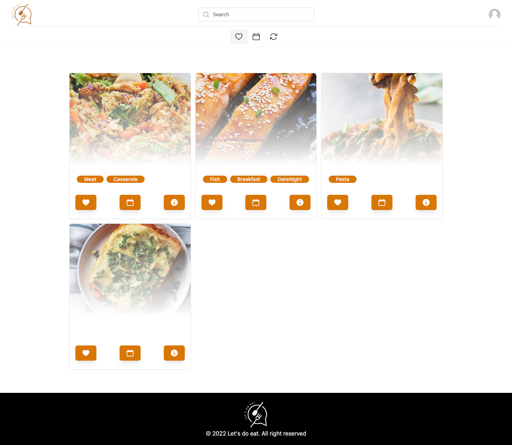
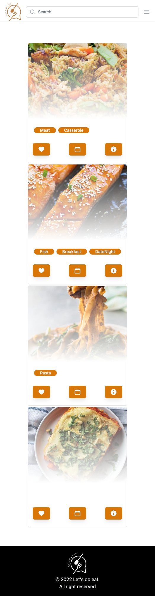

# Conception

## Maquettes

Je commence par faire le design sur papier, puis je le passe sur [balsamiq](https://balsamiq.com/) pour finir sur figma.

## Cahier des charges

Je dois forcément faire un cahier des charges pour mon projet.
Ça me permet d'avoir les bases et de ne pas partir dans tout les sens et avec la maquette ça va le faire tranquille !

Pour le CSS, je vais utiliser le frameworkd

### Fonctionnalités

#### Compoments
Nous pouvons déjà penser qu'il nous faut au moins dans le dossier components :

- Header avec le logo et les boutons (favoris, semaine, random) & enfin login/register.
- Card d'une recette avec 2 boutons (favoris et ajouter à la semaine).
- Footer avec les liens vers les réseaux sociaux.
- Tag pour les catégories de recettes. (strTags, attention, il faut split(",") pour avoir les tags séparés)

#### Pages

- Home avec la liste des recettes ainsi que la recherche
- Page de détail d'une recette.
- Page de la semaine avec les recettes ajoutées.
- Page 404

### Couleurs

- bg : #F5F5F5
- white: #FFFFFF
- primary : #bb7d3c
- secondary : #fff7f7
- background: linear-gradient(180deg, rgba(255, 255, 255, 0) 0%, rgba(0, 0, 0, 0.5) 100%);
border-radius: 10px;

### Icône

- https://fontawesome.com/
  - house (accueil)
  - heart (favoris)
  - dice (aleatoire)
  - calendar-days (agenda)
  - heart-circle-plus (ajouter favoris)
  - calendar-plus (ajouter agenda)
  - user-lock (login)
  - user-plus (inscription)
  - circle-info (info)
  - magnifying-glass (recherche)
  - leaf (vegetarien)
  - wheat-awn (vegan)
  - list (liste)
  - map-location-dot (map)
  - sourcetree (source)
  - kitchen-set (cuisine)
  - cart-shopping (panier)
  - scale-balanced (poids / mesure)
  - youtube (youtube)

### Images

Pour acceder à l'image d'un ingrdient, il faut utiliser l'url suivante :
https://www.themealdb.com/images/ingredients/{ingredien}.png

pour avoir celle du plat, il faut utiliser la clé "strMealThumb" de l'api.
